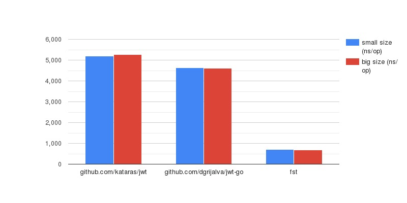
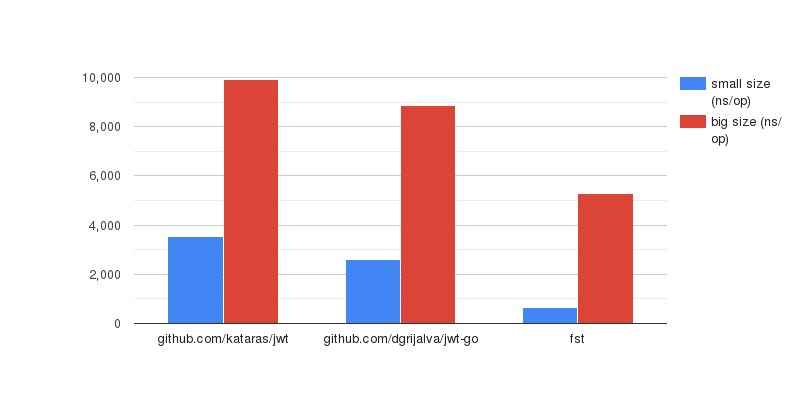
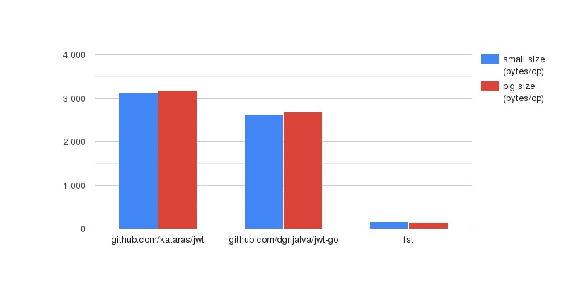
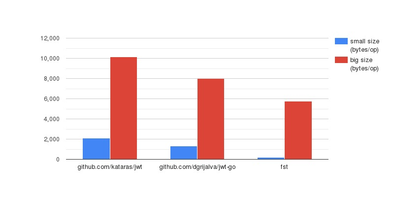
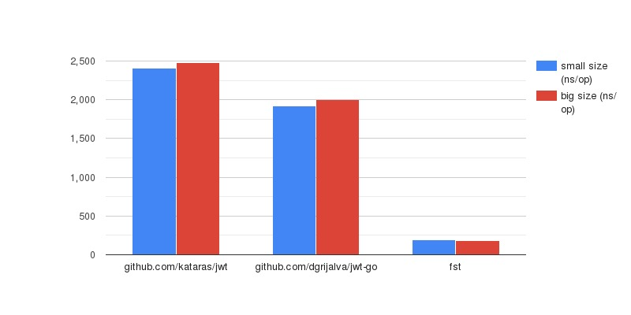
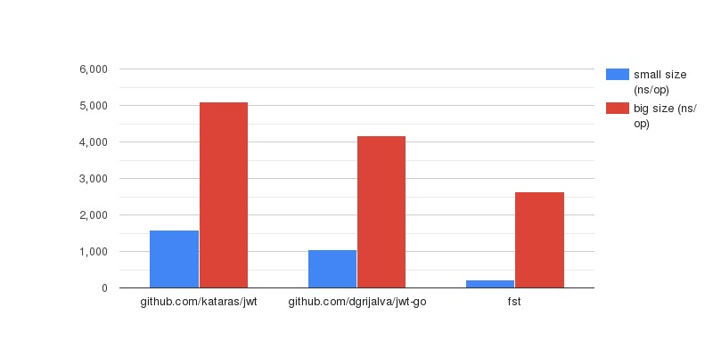

# fst

fst is a high-performance, low-memory library for generating and parsing Fast Signed Tokens (FST). 
FST provides an alternative to JSON-based tokens and allows you to store any information that can be 
represented as `[]byte`. You can use FST for the same purposes as JWT.

## Description

fst is designed to be efficient and lightweight, making it ideal for applications that require fast token generation
and parsing. With its optimized algorithms and data structures, fst minimizes memory usage and maximizes performance.

## Performance

fst excels in terms of performance, especially when compared to traditional token formats like JSON Web Tokens (JWT).
By leveraging its unique token structure and optimized parsing algorithms, fst significantly reduces the overhead
associated with token generation and parsing.

To demonstrate the performance benefits of fst, we conducted a series of tests using various tokens sizes.
The results are as follows:

parsing speed (less is better):



generate speed (less is better):



parsing memory (less is better):


generate memory (less is better):


parallel parsing speed (less is better):


parallel generate speed (less is better):


## Installation

Install fst with the go get command:

`go get github.com/Eugene-Usachev/fst`

## Example

You can see the examples in the `example` folder.

First you need to create a `Converter'. You can do it like this

```go
converter := fst.NewConverter(&fst.ConverterConfig{
    SecretKey:   []byte(`secret`),
    Postfix:     nil,
    ExpireTime:  time.Minute * 5,
    HashType:    sha256.New,
    DisableLogs: false,
})
```

Then you can create a token using the `NewToken` or `NewTokenWithExpire` functions.

```go
token := converter.NewToken([]byte(`token`))
// or create token with set expire time
tokenWithEx := converter.NewTokenWithExpire([]byte(`token`))
```

To parse tokens, you can use the `ParseToken` or `ParseTokenWithExpire` functions.

```go
value, err := converter.ParseToken(token)
// or parse token with set an expiry time
value, err = converter.ParseTokenWithExpire(tokenWithEx)
```
## License

The `fst` library is released under the MIT License.