# Benchmarks

# Parse

<h2>speed in ns/op (less is better)</h2>

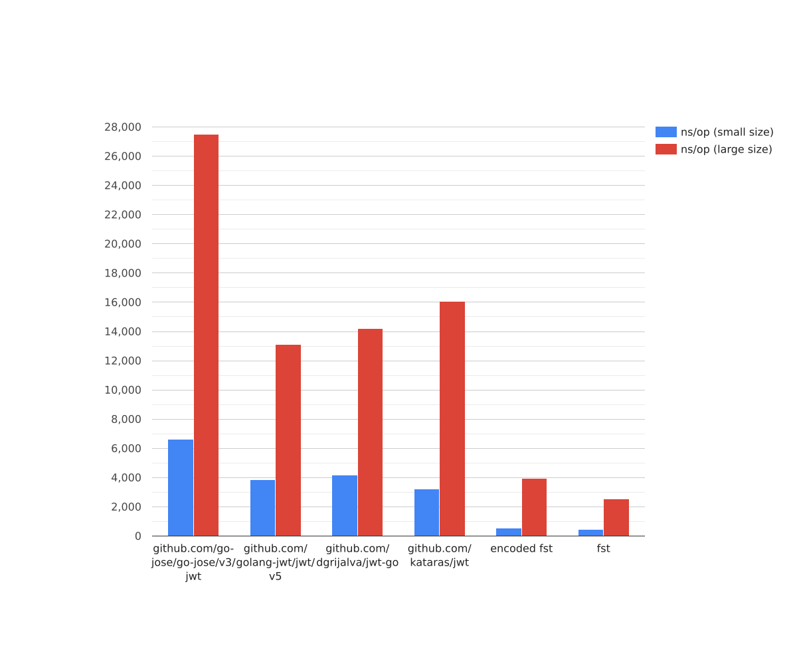

<h2>speed in total repetitions (more is better)</h2>

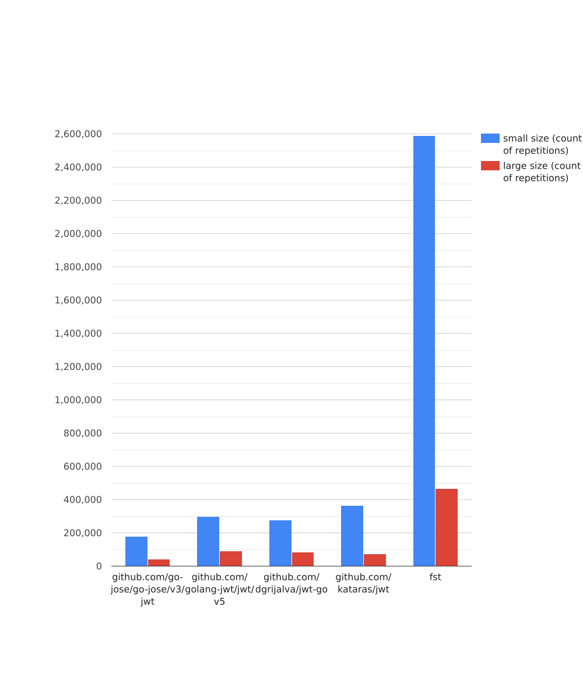

<h2>memory in bytes/op (less is better)</h2>

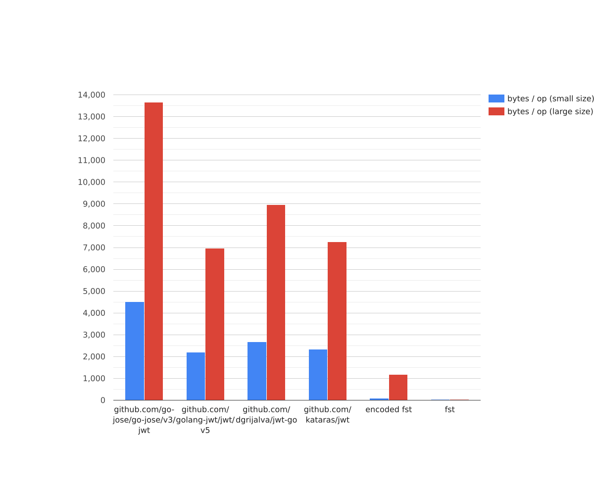

<h2>allocs in allocs/op (less is better)</h2>

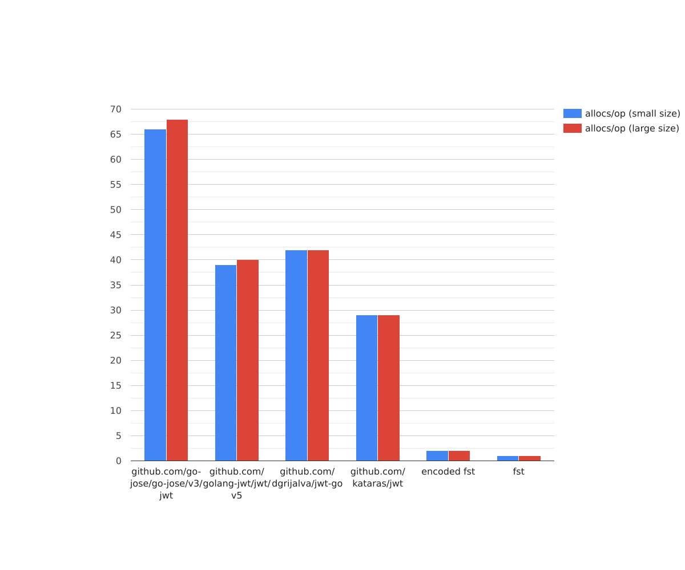

# Generate

<h2>speed in ns/op (less is better)</h2>

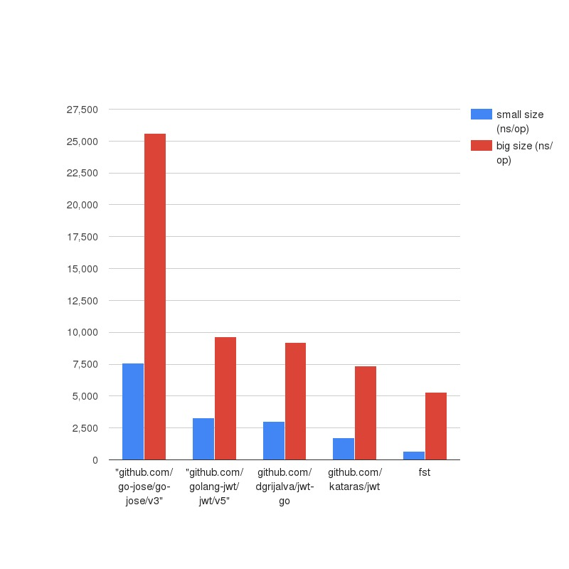

<h2>speed in total repetitions (more is better)</h2>

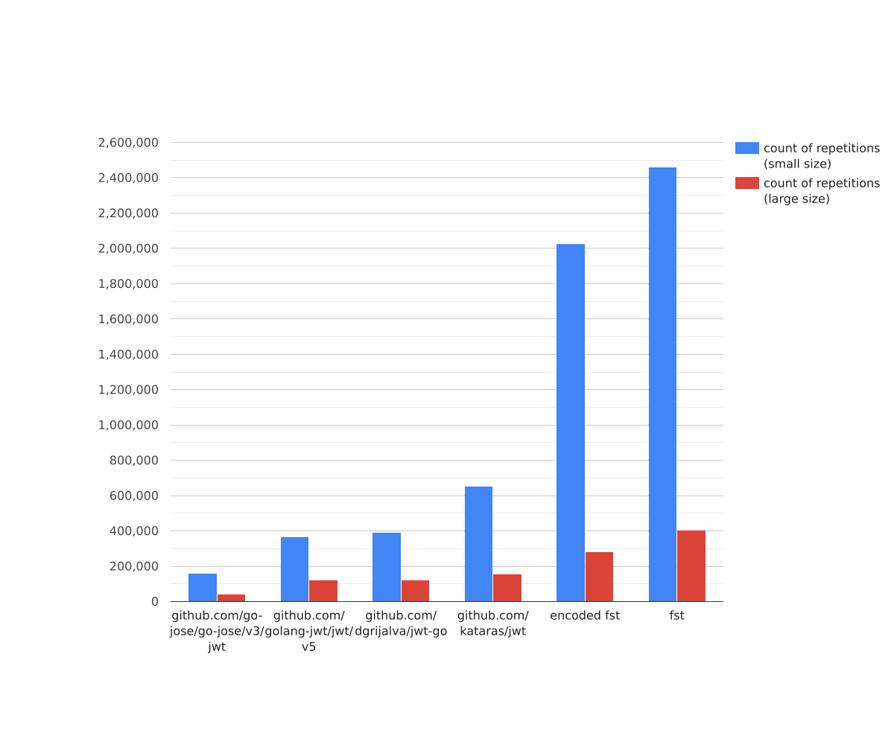

<h2>memory in bytes/op (less is better)</h2>

<h2>allocs in allocs/op (less is better)</h2>

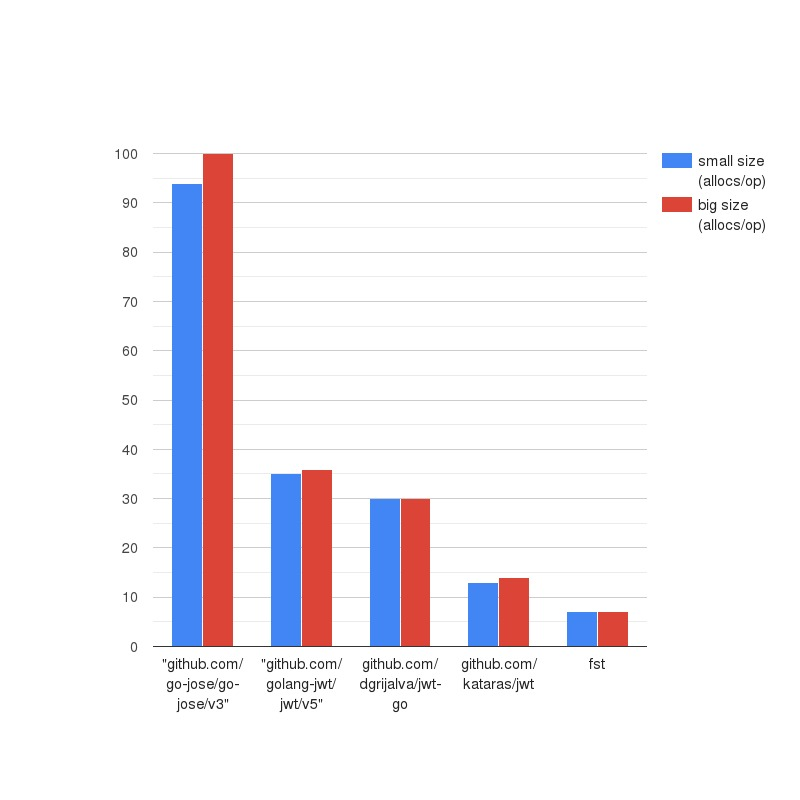

# Parallel parse

<h2>speed in ns/op (less is better)</h2>

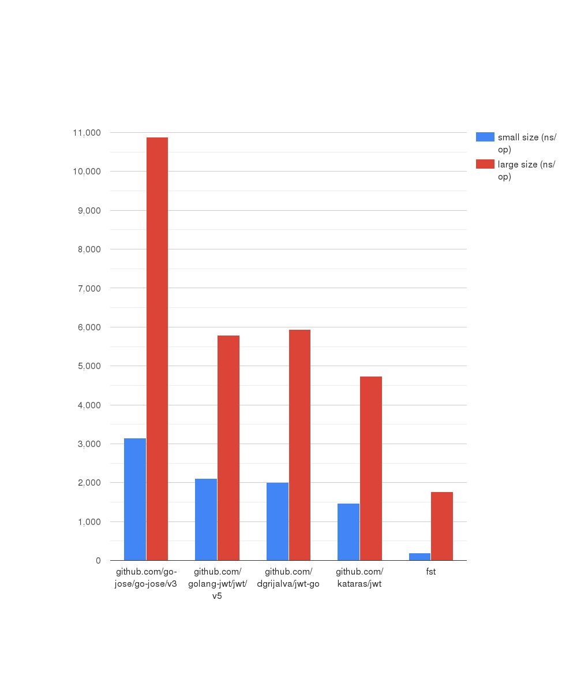

<h2>speed in total repetitions (more is better)</h2>

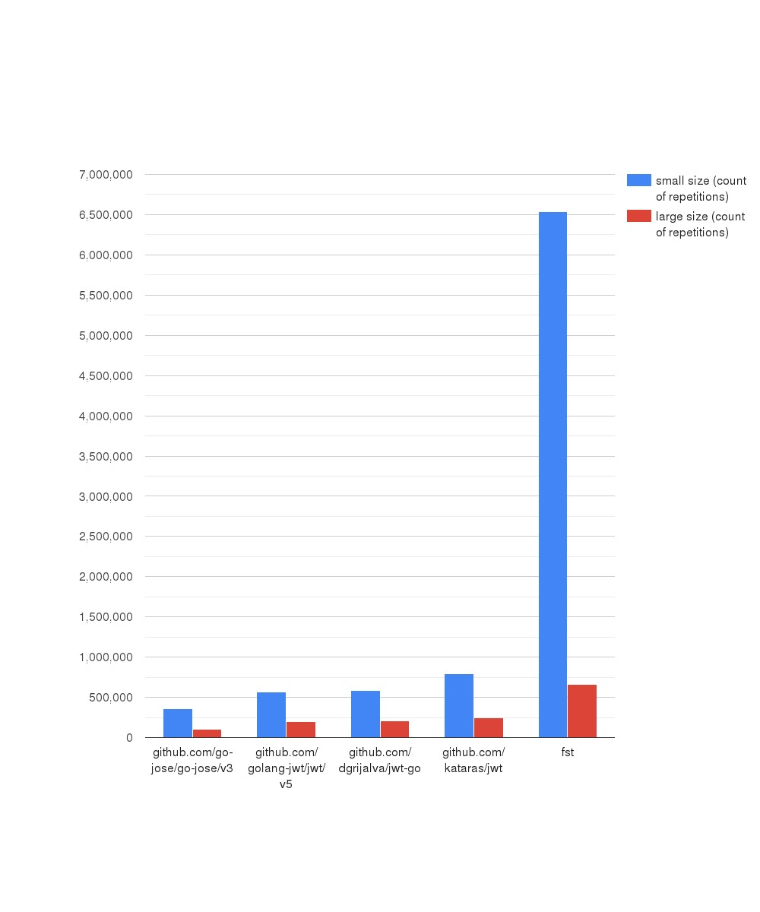

# Parallel generate

<h2>speed in ns/op (less is better)</h2>

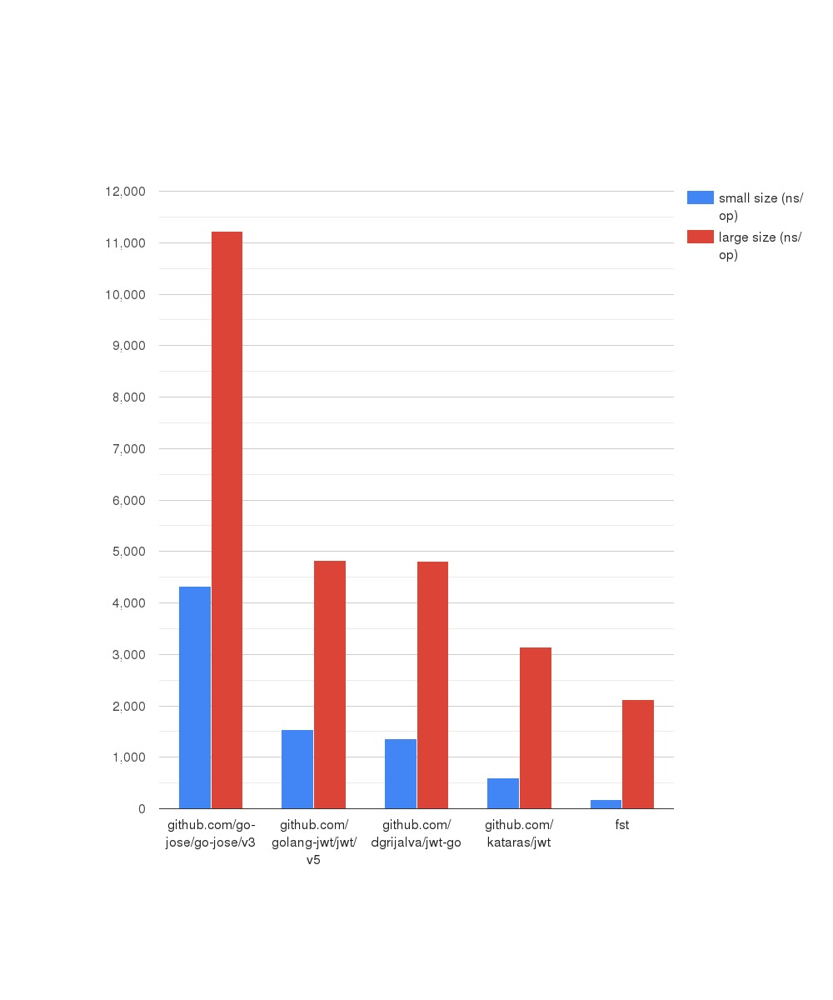

<h2>speed in total repetitions (more is better)</h2>

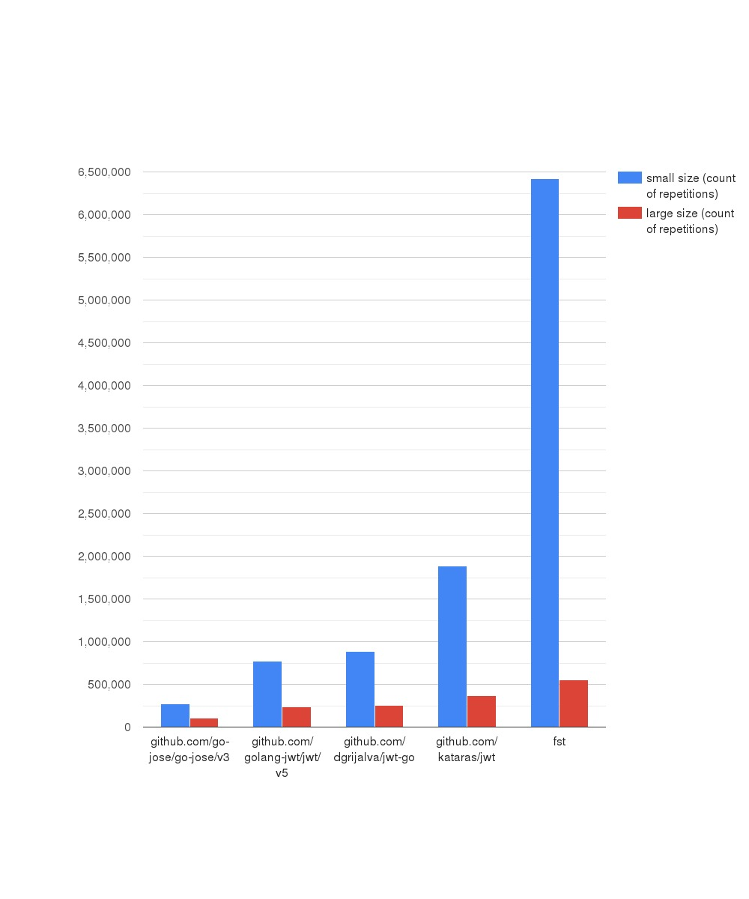

# As text

goos: linux

goarch: amd64

pkg: benches

cpu: Intel(R) Core(TM) i5-9400F CPU @ 2.90GHz

Benchmark                          | Iterations | Time (ns/op) | Bytes (B/op) | Allocations (allocs/op) |
|------------------------------------|------------|--------------|--------------|-------------------------|
| UintGen_GoJose-6                   | 149864     | 7576         | 7001         | 94                      |
| UintGen_GolangJWT-6                | 322376     | 3281         | 2128         | 35                      |
| UintGen_JWT_GO-6                   | 373723     | 3028         | 1768         | 30                      |
| UintGen_JWT-6                      | 635608     | 1720         | 800          | 13                      |
| UintGen_FST-6                      | 1833826    | 649.0        | 192          | 7                       |
| BigStringGen_GoJose-6              | 47018      | 25597        | 21526        | 100                     |
| BigStringGen_GolangJWT-6           | 125097     | 9640         | 10107        | 36                      |
| BigStringGen_JWT_GO-6              | 126990     | 9225         | 9747         | 30                      |
| BigStringGen_JWT-6                 | 160904     | 7357         | 6026         | 14                      |
| BigStringGen_FST-6                 | 224856     | 5293         | 5761         | 7                       |
| UintParse_GoJose-6                 | 163372     | 6516         | 4560         | 67                      |
| UintParse_GolangJWT-6              | 254911     | 4503         | 3120         | 47                      |
| UintParse_JWT_GO-6                 | 265958     | 4297         | 2824         | 46                      |
| UintParse_JWT-6                    | 368376     | 3160         | 2336         | 29                      |
| UintParse_FST-6                    | 1680895    | 710.4        | 160          | 6                       |
| BigStringParse_GoJose-6            | 42302      | 28301        | 15120        | 70                      |
| BigStringParse_GolangJWT-6         | 81157      | 14691        | 10832        | 50                      |
| BigStringParse_JWT_GO-6            | 82338      | 14492        | 10520        | 47                      |
| BigStringParse_JWT-6               | 73455      | 16174        | 7256         | 29                      |
| BigStringParse_FST-6               | 221989     | 5294         | 3985         | 7                       |
| UintGen_GoJose_ASYNC-6             | 258740     | 4480         | 7003         | 94                      |
| UintGen_GolangJWT_ASYNC-6          | 761874     | 1550         | 2129         | 35                      |
| UintGen_JWT_GO_ASYNC-6             | 831608     | 1517         | 1770         | 30                      |
| UintGen_JWT_ASYNC-6                | 1860500    | 612.4        | 800          | 13                      |
| UintGen_FST_ASYNC-6                | 5800948    | 213.0        | 192          | 7                       |
| BigStringGen_GoJose_ASYNC-6        | 92920      | 12004        | 21560        | 100                     |
| BigStringGen_GolangJWT_ASYNC-6     | 238897     | 4862         | 10116        | 36                      |
| BigStringGen_JWT_GO_ASYNC-6        | 243962     | 4788         | 9757         | 30                      |
| BigStringGen_JWT_ASYNC-6           | 381152     | 3164         | 6030         | 14                      |
| BigStringGen_FST_ASYNC-6           | 464019     | 2565         | 5765         | 7                       |
| UintParse_GoJose_ASYNC-6           | 369277     | 3249         | 4560         | 67                      |
| UintParse_GolangJWT_ASYNC-6        | 526790     | 2234         | 3120         | 47                      |
| UintParse_JWT_GO_ASYNC-6           | 570416     | 2071         | 2824         | 46                      |
| UintParse_JWT_ASYNC-6              | 795478     | 1494         | 2336         | 29                      |
| UintParse_FST_ASYNC-6              | 5998849    | 197.8        | 160          | 6                       |
| BigStringParse_GoJose_ASYNC-6      | 104320     | 11826        | 15121        | 70                      |
| BigStringParse_GolangJWT_ASYNC-6   | 188802     | 6238         | 10833        | 50                      |
| BigStringParse_JWT_GO_ASYNC-6      | 190770     | 6224         | 10521        | 47                      |
| BigStringParse_JWT_ASYNC-6         | 233523     | 5248         | 7256         | 29                      |
| BigStringParse_FST_ASYNC-6         | 496048     | 2431         | 3989         | 7                       |