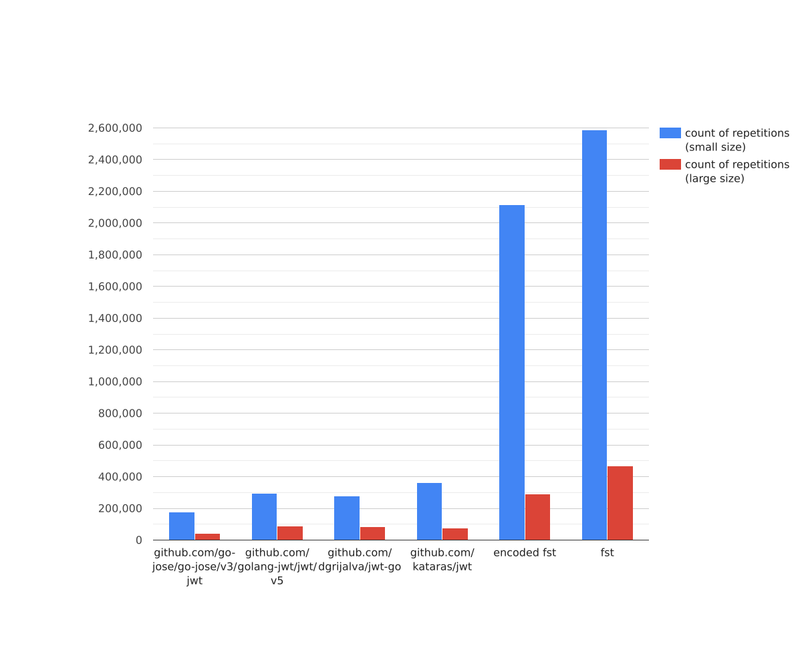

# Benchmarks

# Parse

<h2>speed in ns/op (less is better)</h2>

<h2>speed in total repetitions (more is better)</h2>

<h2>memory in bytes/op (less is better)</h2>

<h2>allocs in allocs/op (less is better)</h2>

# Generate

<h2>speed in ns/op (less is better)</h2>

<h2>speed in total repetitions (more is better)</h2>

<h2>memory in bytes/op (less is better)</h2>

<h2>allocs in allocs/op (less is better)</h2>

# Parallel parse

<h2>speed in ns/op (less is better)</h2>

<h2>speed in total repetitions (more is better)</h2>

# Parallel generate

<h2>speed in ns/op (less is better)</h2>

<h2>speed in total repetitions (more is better)</h2>

# As text

goos: linux

goarch: amd64

pkg: benches

cpu: Intel(R) Core(TM) i5-9400F CPU @ 2.90GHz

Benchmark                          | Iterations | Time (ns/op) | Bytes (B/op) | Allocations (allocs/op) |
|------------------------------------|------------|--------------|--------------|-------------------------|
| UintGen_GoJose-6                   | 154857     | 7533         | 7001         | 94                      |
| UintGen_GolangJWT-6                | 345100     | 3290         | 2128         | 35                      |
| UintGen_JWT_GO-6                   | 378730     | 3051         | 1768         | 30                      |
| UintGen_JWT-6                      | 653710     | 1745         | 800          | 13                      |
| UintGen_FST-6                      | 1871828    | 655.0        | 180          | 6                       |
| BigStringGen_GoJose-6              | 46407      | 25814        | 21529        | 100                     |
| BigStringGen_GolangJWT-6           | 125601     | 9566         | 10107        | 36                      |
| BigStringGen_JWT_GO-6              | 127270     | 9312         | 9748         | 30                      |
| BigStringGen_JWT-6                 | 159567     | 7460         | 6026         | 14                      |
| BigStringGen_FST-6                 | 237229     | 4972         | 4353         | 6                       |
| UintParse_GoJose-6                 | 179474     | 6542         | 4560         | 67                      |
| UintParse_GolangJWT-6              | 264673     | 4389         | 3120         | 47                      |
| UintParse_JWT_GO-6                 | 271388     | 4257         | 2824         | 46                      |
| UintParse_JWT-6                    | 367329     | 3151         | 2336         | 29                      |
| UintParse_FST-6                    | 1747142    | 689.2        | 145          | 5                       |
| BigStringParse_GoJose-6            | 42804      | 27779        | 15120        | 70                      |
| BigStringParse_GolangJWT-6         | 83590      | 14128        | 10832        | 50                      |
| BigStringParse_JWT_GO-6            | 85699      | 13945        | 10520        | 47                      |
| BigStringParse_JWT-6               | 76929      | 15454        | 7256         | 29                      |
| BigStringParse_FST-6               | 236289     | 4986         | 2576         | 6                       |
| UintGen_GoJose_ASYNC-6             | 274987     | 4316         | 7003         | 94                      |
| UintGen_GolangJWT_ASYNC-6          | 768590     | 1544         | 2129         | 35                      |
| UintGen_JWT_GO_ASYNC-6             | 881838     | 1359         | 1769         | 30                      |
| UintGen_JWT_ASYNC-6                | 1887468    | 605.4        | 800          | 13                      |
| UintGen_FST_ASYNC-6                | 6422296    | 184.0        | 180          | 6                       |
| BigStringGen_GoJose_ASYNC-6        | 108676      | 11219        | 21548        | 100                     |
| BigStringGen_GolangJWT_ASYNC-6     | 240136     | 4827         | 10116        | 36                      |
| BigStringGen_JWT_GO_ASYNC-6        | 251836     | 4817         | 9756         | 30                      |
| BigStringGen_JWT_ASYNC-6           | 368892     | 3138         | 6031         | 14                      |
| BigStringGen_FST_ASYNC-6           | 549912     | 2123         | 4356         | 6                       |
| UintParse_GoJose_ASYNC-6           | 363255     | 3153         | 4560         | 67                      |
| UintParse_GolangJWT_ASYNC-6        | 563154     | 2110         | 3120         | 47                      |
| UintParse_JWT_GO_ASYNC-6           | 585115     | 2011         | 2824         | 46                      |
| UintParse_JWT_ASYNC-6              | 797620     | 1477         | 2336         | 29                      |
| UintParse_FST_ASYNC-6              | 6540771    | 199.8        | 145          | 5                       |
| BigStringParse_GoJose_ASYNC-6      | 104954     | 10886        | 15121        | 70                      |
| BigStringParse_GolangJWT_ASYNC-6   | 199915     | 5794         | 10833        | 50                      |
| BigStringParse_JWT_GO_ASYNC-6      | 205317     | 5943         | 10521        | 47                      |
| BigStringParse_JWT_ASYNC-6         | 244266     | 4739         | 7256         | 29                      |
| BigStringParse_FST_ASYNC-6         | 665750     | 1772         | 2579         | 6                       |